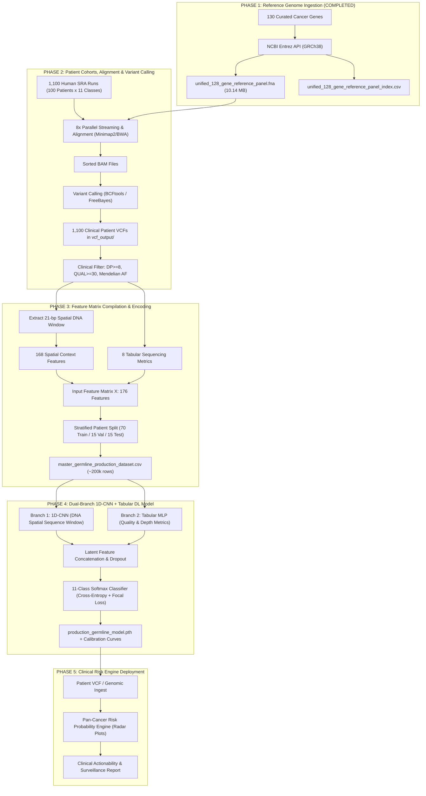

# Master Implementation Plan: Multi-Class Germline Pan-Cancer Genomic Risk Engine

**Production Specification:** Aligned with FDA-regulated frameworks (MSK-IMPACT, Illumina TruSight Oncology, Invitae Multi-Cancer PRS)  
**Reference Document:** [ab1098b2-bda8-47bd-a10d-37ce1f117e63_dataset.pdf](file:///d:/DL/ab1098b2-bda8-47bd-a10d-37ce1f117e63_dataset.pdf)  
**Workspace:** `D:\DL`

---

## 1. System Architecture Overview: The "Golden Ratio"

The platform bridges high-throughput bioinformatics (SRA ingestion, read alignment, variant calling) with deep learning (Dual-Branch 1D-CNN + Tabular Neural Network) across **11 Pan-Cancer Classes** with zero data leakage and balanced cohorts.



---

## 2. Detailed Phase Breakdown & Milestones

### Phase 1: Reference Genome Ingestion & Panel Quality Control
> **Status:** **COMPLETED** (Artifacts verified in `D:\DL`)

| Milestone | Deliverables / Artifacts | Status |
|---|---|:---:|
| **1.1 Gene Panel Curation** | Complete audit of all 130 driver genes across 7 pathways | **DONE** |
| **1.2 Coordinate Mapping** | Primary assembly GRCh38 mapping (`NC_000001` - `NC_000024`) | **DONE** |
| **1.3 FASTA Download** | [unified_128_gene_reference_panel.fna](file:///D:/DL/unified_128_gene_reference_panel.fna) (`10.14 MB`, `9,886,296 bp`) | **DONE** |
| **1.4 Manifest & Indexing** | [master_cancer_genes_annotated.csv](file:///D:/DL/master_cancer_genes_annotated.csv) & [unified_128_gene_reference_panel_index.csv](file:///D:/DL/unified_128_gene_reference_panel_index.csv) | **DONE** |

---

### Phase 2: Patient SRA Streaming, Alignment & Variant Calling
> **Objective:** Process **1,100 patient sequencing runs** (100 patients per class across 11 cancers) without storing unnecessary raw FASTQs, producing filtered clinical VCFs.

#### Step 2.1: SRA Cohort Query & Patient Metadata Table
* Query NCBI SRA database using the exact query specifications from Section 3 of the blueprint:

| Class ID | Target Cancer Category | Specific NCBI Human SRA Cohort Query (`tax_eq(9606)`) | Target Patients |
|:---:|---|---|:---:|
| **0** | Oral Cavity Carcinoma | `tax_eq(9606) AND study_title="oral squamous cell carcinoma"` | 100 |
| **1** | Lung Cancer | `tax_eq(9606) AND study_title="lung adenocarcinoma"` | 100 |
| **2** | Female Breast Cancer | `tax_eq(9606) AND study_title="*breast carcinoma*"` | 100 |
| **3** | Colorectal Cancer | `tax_eq(9606) AND study_title="*colorectal adenocarcinoma*"` | 100 |
| **4** | Prostate Cancer | `tax_eq(9606) AND study_title="*prostate adenocarcinoma*"` | 100 |
| **5** | Stomach (Gastric) Cancer | `tax_eq(9606) AND study_title="*gastric cancer*"` | 100 |
| **6** | Thyroid Cancer | `tax_eq(9606) AND study_title="*thyroid carcinoma*"` | 100 |
| **7** | Liver Cancer (HCC) | `tax_eq(9606) AND study_title="*hepatocellular carcinoma*"` | 100 |
| **8** | Bladder Cancer | `tax_eq(9606) AND study_title="*bladder urothelial*"` | 100 |
| **9** | Cervical Cancer | `tax_eq(9606) AND study_title="*cervical carcinoma*"` | 100 |
| **10** | Non-Hodgkin Lymphoma | `tax_eq(9606) AND study_title="*diffuse large b-cell lymphoma*"` | 100 |
| **TOTAL** | **11 PAN-CANCER CLASSES** | **Balanced Human Cohort** | **1,100 Patients** |

* **Script:** `query_sra_cohorts.py` $\rightarrow$ outputs `patient_cohort_manifest.csv` containing `Run_Accession` (e.g. `SRR...`), `Patient_ID`, `Cancer_Class_ID`, `BioProject`, `Library_Layout` (PAIRED/SINGLE).

#### Step 2.2: Mini-Reference Panel Indexing
* Index `unified_128_gene_reference_panel.fna` using `bwa index` or `minimap2 -d reference_panel.mmi`.
* Because the reference panel is only **10.14 MB**, alignment against this target index is **>100x faster** than aligning against the entire 3.2 GB human genome, fitting easily in memory.

#### Step 2.3: Multi-Threaded Streaming & Alignment Pipeline
* Implement an 8-worker parallel pipeline (`stream_align_cohort.py`):
  * **Option A (Direct HTTP Pipe):** Pipe reads from `fastq-dump` / `fasterq-dump --stdout` or NCBI HTTP directly into the aligner without writing multi-GB FASTQ files to disk:
    ```bash
    fasterq-dump --stdout SRRXXXXXXX | minimap2 -ax sr reference_panel.mmi - | samtools view -b -F 4 - | samtools sort -o bams/SRRXXXXXXX.bam
    ```
  * **Option B (Direct SRA streaming via python):** Extract only aligned reads matching the target 130 genes.

#### Step 2.4: Variant Calling (VCF Generation)
* Call germline variants using `bcftools mpileup -Ou -f unified_128_gene_reference_panel.fna ... | bcftools call -mv -Oz -o vcf_output/patient_ID.vcf.gz`.
* Index each VCF file with `bcftools index`.

#### Step 2.5: Clinical Standard Quality Filtering
Apply the strict clinical germline filters defined in Section 4 of the blueprint:
1. **Depth Filter:** $DP \ge 8$ (Guarantees sufficient read support; drops low-depth noise).
2. **Quality Filter:** $QUAL \ge 30.0$ (99.9% base calling accuracy).
3. **Mendelian Allele Fraction (AF) Rules:**
   * **Heterozygous Carrier (0/1):** $0.35 \le AF \le 0.65$
   * **Homozygous Variant (1/1):** $AF \ge 0.85$
   * **Drop Filter:** Any $AF < 0.35$ is dropped as somatic sub-clonal noise or sequencing error.

---

### Phase 3: Master Dataset Compilation & Feature Engineering (176 Features)
> **Objective:** Transform the 1,100 patient VCFs into the unified machine learning matrix `master_germline_production_dataset.csv` (~200,000 rows $\times$ 176 features).

#### Step 3.1: 21-bp DNA Spatial Context Window
* For each filtered variant at genomic position $P$:
  * Extract **10 bp upstream** from the reference panel sequence.
  * Extract the **mutated base** (alternative allele).
  * Extract **10 bp downstream** from the reference panel sequence.
  * **Total Spatial Window:** Exactly 21 nucleotides centered on the mutation.

#### Step 3.2: 168-dimensional Sequence Encoding (Branch 1 Input)
* Each nucleotide in the 21-bp window is mapped across 8 biological / physicochemical and positional channels:
  * 4 channels: One-hot nucleotide vector ($A=[1,0,0,0], C=[0,1,0,0], G=[0,0,1,0], T=[0,0,0,1]$).
  * 2 channels: Purine/Pyrimidine and Hydrogen bond count (A/T=2, G/C=3).
  * 2 channels: Strand orientation and position distance relative to mutation center.
  * **Total Dimension:** $21 \text{ positions} \times 8 \text{ channels} = \mathbf{168 \text{ Features}}$.

#### Step 3.3: 8-dimensional Tabular Metric Features (Branch 2 Input)
1. `DP`: Total sequencing read depth at the variant site (log-scaled).
2. `QUAL`: Phred-scaled variant quality score.
3. `AF`: Observed allele fraction ($0.35 - 1.0$).
4. `Zygosity`: Binary indicator ($0$ = Heterozygous `0/1`, $1$ = Homozygous `1/1`).
5. `Variant_Type`: Categorical encoding ($0$ = SNV Transition, $1$ = SNV Transversion, $2$ = Deletion, $3$ = Insertion).
6. `Local_GC_Content`: GC percentage within the 21-bp spatial window.
7. `Exon_Relative_Position`: Fractional distance from exon boundary ($0.0 - 1.0$).
8. `Gene_Length_Normalized`: Normalized length of the harboring gene locus.
* **Total Dimension:** $\mathbf{8 \text{ Features}}$.

$$\mathbf{\text{Total Input Matrix (X)}} = 168 \text{ (Spatial Context)} + 8 \text{ (Metrics)} = \mathbf{176 \text{ Features}}$$

#### Step 3.4: Patient-Stratified Splitting (Zero Data Leakage)
* **Critical Requirement:** Variants from the same patient must **never** be split across train and test sets.
* **Splitting Strategy:** Group-stratified split by `Patient_ID` and `Cancer_Class`:
  * **Train Set:** 70% of patients (~770 patients, ~140,000 variants)
  * **Validation Set:** 15% of patients (~165 patients, ~30,000 variants)
  * **Test Set:** 15% of patients (~165 patients, ~30,000 variants)

---

### Phase 4: Dual-Branch 1D-CNN + Tabular Deep Learning Model
> **Objective:** Build, train, calibrate, and validate the pan-cancer neural network in PyTorch.

#### Step 4.1: Model Architecture Specification
* **Branch 1 (1D-CNN Sequence Encoder):**
  * Input: $(N, 8, 21)$ tensor representing the 21-bp DNA spatial context.
  * Conv1D Layer 1: 64 filters, kernel size 3, padding 1, ReLU, BatchNorm.
  * Conv1D Layer 2: 128 filters, kernel size 3, padding 1, ReLU, BatchNorm.
  * Squeeze-and-Excitation / Residual Block: Channel attention.
  * Global Adaptive Average Pooling $\rightarrow$ 128-dimensional sequence latent vector.
* **Branch 2 (Tabular MLP Encoder):**
  * Input: $(N, 8)$ vector representing the sequencing metrics.
  * Dense Layer 1: 64 units, BatchNorm, LeakyReLU, Dropout(0.2).
  * Dense Layer 2: 64 units, BatchNorm, LeakyReLU.
* **Cross-Branch Fusion & Head:**
  * Concatenate: $128 \text{ (CNN)} + 64 \text{ (MLP)} = 192\text{-dim}$ fused representation.
  * Dense 1: 128 units, ReLU, Dropout(0.3).
  * Dense 2: 64 units, ReLU.
  * Output Layer: 11 logits (one per cancer class).

#### Step 4.2: Loss Function & Training Optimization
* **Loss Function:** Focal Cross-Entropy Loss ($\gamma = 2.0$, label smoothing $\alpha = 0.05$) to handle hard mutational patterns.
* **Optimizer:** AdamW (learning rate $10^{-3}$, weight decay $10^{-4}$).
* **Scheduler:** CosineAnnealingWarmRestarts with early stopping on validation macro-F1.

#### Step 4.3: Model Evaluation Metrics
* Multi-Class AUC-ROC (One-vs-Rest and Macro-averaged).
* Macro F1-score across all 11 classes.
* Confusion Matrix and top-1 / top-3 classification accuracy.
* Platt scaling / Isotonic regression for probability calibration curves.

---

### Phase 5: Production Deployment & Clinical Prediction CLI
> **Objective:** Deliver an enterprise-grade inference tool.

* **Inference Script (`predict_patient_cancer_risk.py`):**
  * Accepts any new patient's VCF or genomic variant list.
  * Encodes the 176 features automatically.
  * Passes through `production_germline_model.pth`.
  * Computes an **Aggregate Patient Pan-Cancer Risk Score** across all their constitutional mutations.
  * Outputs:
    1. A printable clinical report with a 11-axis **Pan-Cancer Risk Radar Plot**.
    2. Ranked risk probabilities for each cancer type.
    3. Actionable screening recommendations (e.g. breast MRI, colonoscopy, PSA screening, PARPi eligibility).

---

## 3. Implementation Roadmap & Execution Checklist

```
[Phase 1] Reference Panel (COMPLETED)
  ├── [x] Audit 130 genes and clinical pathways
  ├── [x] Ingest GRCh38 primary assembly sequences into unified_128_gene_reference_panel.fna
  ├── [x] Generate master annotated CSV and FASTA line index CSV

[Phase 2] Patient Cohort SRA Pipeline (NEXT)
  ├── [ ] Step 2.1: Build `query_sra_cohorts.py` to index 100 SRA runs per class (1,100 total)
  ├── [ ] Step 2.2: Test 1-sample prototype (Breast or Lung cancer SRA -> Alignment -> VCF)
  ├── [ ] Step 2.3: Scale 8x parallel stream-alignment engine (`stream_align_cohort.py`)
  └── [ ] Step 2.4: Execute clinical filters (DP>=8, QUAL>=30, Mendelian AF)

[Phase 3] Master Dataset Compilation
  ├── [ ] Step 3.1: Build `build_production_dataset.py` (extract 21-bp context + 8 metrics)
  ├── [ ] Step 3.2: Verify 176 features and zero-data-leakage patient-level 70/15/15 split
  └── [ ] Step 3.3: Save `master_germline_production_dataset.csv` (~200,000 rows)

[Phase 4] Deep Learning Training
  ├── [ ] Step 4.1: Implement Dual-Branch 1D-CNN + Tabular model in PyTorch
  ├── [ ] Step 4.2: Train model with Cosine Annealing + Focal Loss
  └── [ ] Step 4.3: Export `production_germline_model.pth` and calibration plots

[Phase 5] Inference & CLI
  └── [ ] Step 5.1: Build CLI for single-patient cancer risk prediction & clinical report
```
